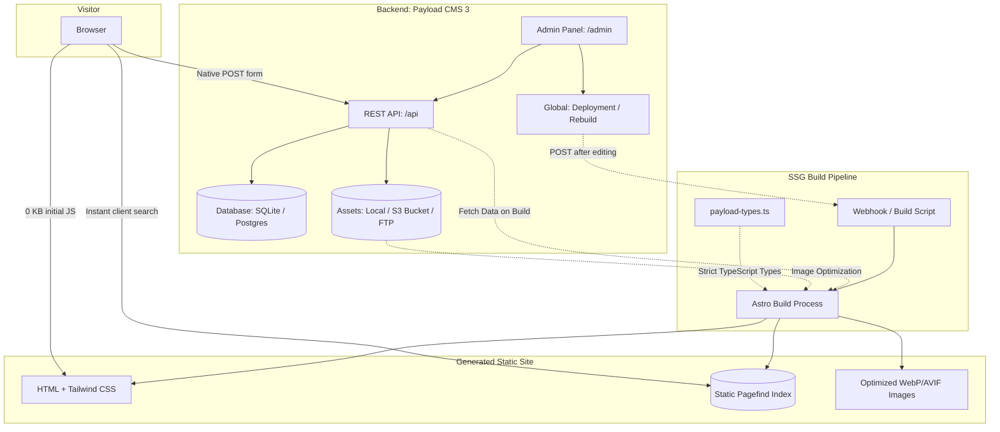

# Specification 01: Overall System Architecture

## 1. Context and Goals
This architecture defines a minimalist web template focused on performance, modern developer experience, and clean decoupling between data management (CMS) and static delivery (SSG).

### Key Technical Targets:
- **Zero Runtime JavaScript**: Pages generated by Astro deliver static HTML by default with no client hydration overhead.
- **Decoupled SSG**: The frontend compiles to static assets without exposing production databases to visitors.
- **Database Flexibility**: Default SQLite with zero configuration, and native switch to PostgreSQL or any Payload-supported engine.
- **Flexible Asset Storage**: Persistent local storage, cloud S3/Cloudflare R2 buckets, and FTP mounts.
- **Global Deployment Hook**: Centralized site rebuild trigger via the `Deploy` global or REST webhook.
- **Optional i18n**: Pre-configured internationalization in CMS and Astro with no mandatory prefixes on default routes.

---

## 2. Architecture Diagram

