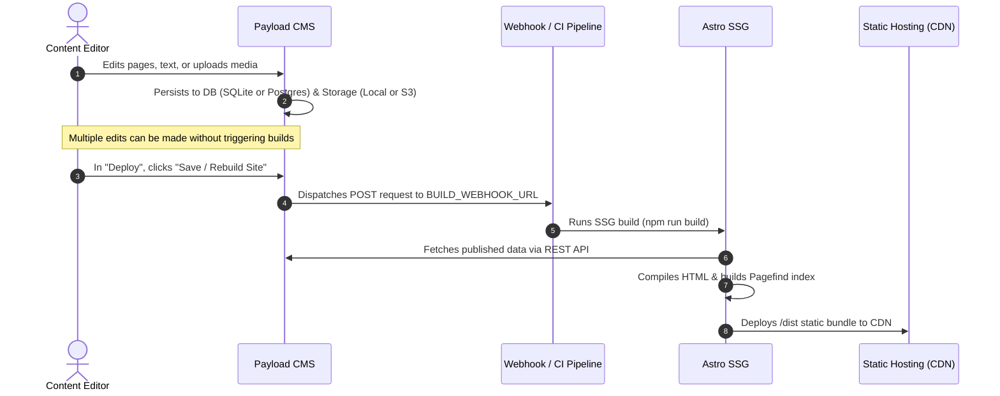

# Specification 04: Content Lifecycle & Workflows

## 1. Decoupled Content Lifecycle
The standard workflow for editing, publishing, and rebuilding follows this sequence:

---

## 2. Creating a New Website Using this Template
1. **Configure Database**:
   - Keep SQLite for default development.
   - Set `DATABASE_URI=postgresql://...` in `.env` for PostgreSQL.
2. **Configure Storage**:
   - Retain local storage or set `S3_BUCKET` for Cloudflare R2 / AWS S3.
3. **Set Domain & Metadata**:
   - Adjust `site` in `frontend/astro.config.mjs` (e.g. `site: 'https://mydomain.com'`).
4. **Create Custom Collections**:
   - Add collections in `backend/src/collections/` and run `npm run generate:types`.
5. **Set Production Webhook**:
   - Set `BUILD_WEBHOOK_URL` in `.env` to hook into your hosting provider or CI runner.
